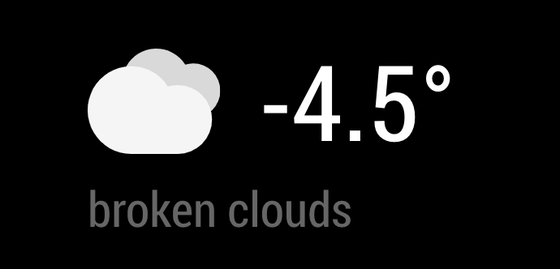

# MagicMirror Module: Weather

`MMM-Weather` is a module for [MagicMirror](https://github.com/MichMich/MagicMirror) that shows current weather conditions in a cleaner way than the default one. It's UI is heavily inspired by [Max Braun's Smart Mirror Project](https://github.com/maxbbraun/mirror) (which is also the source for the icons.).



## Usage

### Setup

Clone this module into your MagicMirror's `modules` directory and install dependencies:

```sh
cd modules
git clone https://github.com/timvonwerne/MMM-Weather
```

then add the module to your MagicMirror's configuration. Here is an example:

```javascript
/* MagicMirror/config/config.js */
{
    /* ...your other config here */

    modules: [

        /* ...your other modules here */

        {
            module: "MMM-Weather",
            header: "",
            position: "top_left",
            config: {
                apiKey: String,
                locationID: Number,
                updateInterval: Number,
                animationSpeed: Number
            }
        }
    ]
}
```

## Sources / Inspiration
- [maxbbraun/mirror](https://github.com/maxbbraun/mirror)
- [MichMich/MagicMirror (default currentweather module)](https://github.com/MichMich/MagicMirror/tree/master/modules/default/currentweather)
